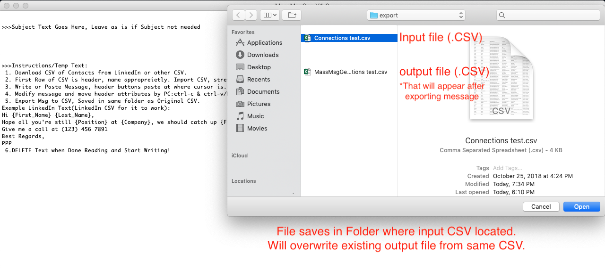
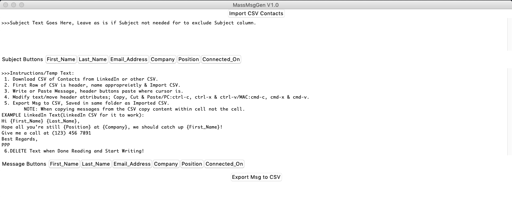
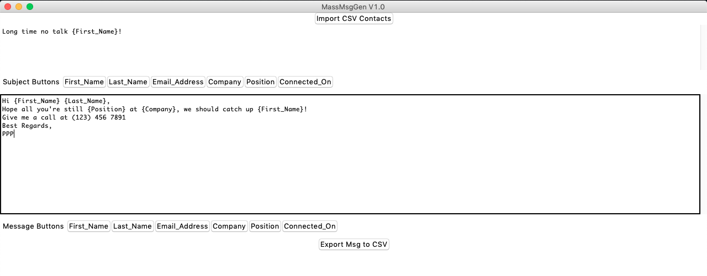

## Download LinkedIn Contacts
source: www.linkedin.com/pulse/how-easily-export-your-connections-much-more-new-linkedin-hammoud/

1. Login to LinkedIn
2. Go-To: https://www.linkedin.com/psettings/member-data
3. Under “Pick And Choose”, Check Connections.
4. Request Archive
5. Wait for Archive Request to complete pending
6. Receive LinkedIn link via Email Open and Click “Download Archive”
7. Unzip folder for “Connections.CSV” file
8. Delete any empty columns (Email row require opt-in from users)

## MassMsgGen Instructions

MassMsgGen Technical Info:
>1. Python based Solution for creating Mass Messages Contact List in *.CSV. 
>2. Both for Mac & Windows executable files available
>3. May open Terminal or Command Prompt when executed, close only after completed using.
>4. Used tkinter for GUI and Pyinstaller to convert .py to respective formats.
>5. If value missing in contacts info that was used in message or subject, 'Missg Used Val' colunm will state 'True' next to respective contact.

Subject Instructions:
>1. Subject Text Goes in Top Textbox, Leave as is if Subject not needed
>2. Subject Colunm will be removed if text not modfied

Textbox/Messagebox Instructions:
>1. Download CSV of Contacts from LinkedIn or other CSV.
>2. First Row of CSV is header, name appropreietly & Import CSV.
>3. Write or Paste Message, header buttons paste where cursor is.
>4. Modify text/move header attributes; Copy, Cut & Paste/PC:ctrl-c, ctrl-x & ctrl-v/MAC:cmd-c, cmd-x & cmd-v.
>5. Export Msg to CSV, Saved in same folder as Imported CSV.
>>NOTE: When copying messages from the CSV copy content within cell not the cell.
>6. DELETE Temp Text when Done Reading and Start Writing!

### Initial

### Uploading

### Uploaded

### Written Subject & Message

